# Nostr Collectives: Overview

## The Problem

### Today's Nostr Assumption

```
Identity = Individual
One person, one npub, one voice.
```

Groups in Nostr (NIP-29, NIP-72) are **containers**, not **actors**. They can't:
- Speak with a collective voice
- Own portable identity across relays
- Form relationships with other groups

### The Broader Problem (Beyond Nostr)

This isn't just a Nostr issue—it's the fundamental architecture of online groups:

| Dimension | Current State | Pain |
|-----------|---------------|------|
| **Identity** | Group exists "inside" a platform | No agency, no voice outside the silo |
| **Membership** | Platform-specific, non-portable | Rebuild reputation from scratch everywhere |
| **Relationships** | Groups are isolated islands | Can't federate, ally, or recognize each other |
| **Continuity** | Platform owns the group | Deplatforming = death, no migration path |
| **Governance** | Platform dictates rules | No self-determination |

> **Groups are tenants, not citizens.**

## The Solution

### Collective Identity

```
Identity = Individual OR Collective
A collective is an npub that represents shared identity.
Members act within the collective's commons via capabilities.
Stewards govern who can do what.
```

### Three Primitives

```
┌─────────────────────────────────────────────────────────────┐
│                   COLLECTIVE IDENTITY                        │
│              (npub that represents a group)                  │
│                                                              │
│   ┌─────────────────────┐    ┌─────────────────────┐        │
│   │       NosCAP        │    │  Commons Enforcement│        │
│   │   (capabilities)    │───►│  (relay validation) │        │
│   └─────────────────────┘    └─────────────────────┘        │
└─────────────────────────────────────────────────────────────┘
```

| Primitive | What it does |
|-----------|--------------|
| **Collective Identity** | Defines what a collective IS—an npub with stewards |
| **NosCAP** | How capabilities are granted and attenuated |
| **Commons Enforcement** | How relays validate caps and index collective content |

## Core Concepts

### Collective

An **npub** that represents a group, organization, or multi-party entity. It has:
- Profile (kind:0) - name, description, picture
- Metadata (kind:39000) - stewards, policies
- Commons - content published in its name

### Commons

The collection of events belonging to a collective. Identified by the `["commons", "<collective_npub>"]` tag.

### Cap (Capability)

A signed grant authorizing specific actions, issued by the collective, a steward, or a delegator:
- `publish` - Create events of specified kinds
- `delete` - Remove events (kind:5)
- `access` - Read private content (future)
- `delegate` - Issue attenuated caps to others

### Steward

A member with authority to govern the collective:
- Issues and revokes caps
- Manages collective profile
- Holds or shares access to collective's nsec

## Key Properties

### Backwards Compatible

Collectives are just npubs. Existing clients:
- Can follow them (no changes)
- Can display their posts (no changes)
- Can show their profile (no changes)

### Portable

Collective identity is not tied to any relay or platform. The npub works everywhere Nostr works.

### Composable

Collectives can connect by exchanging caps:
- Alliance: Mutual full access
- Federation: Shared membership
- Coalition: Time-limited collaboration

### Self-Sovereign

Collectives control their own:
- Membership policies (via caps)
- Content policies (via commons rules)
- Inter-group relationships (via cap exchange)

## Terminology

| Term | Definition |
|------|------------|
| **Collective** | An npub representing a group |
| **Commons** | Events belonging to a collective |
| **Cap** | A signed grant of actions |
| **Steward** | Member who governs the collective |
| **NosCAP** | The capability system for Nostr |

## Architecture

### Use Case 1: Single Collective

A simple setup with one collective, one commons, and two members with different access levels.

```mermaid
flowchart TB
    subgraph Relay["🖥️ Relay<br/><i>enforces CAPs</i>"]
    end

    subgraph Collective["🏛️ Research Collective"]
        CID[("npub1research...")]
        subgraph Commons["📂 Commons: Discussion"]
            Posts["kind:1 notes"]
        end
    end

    Alice["👤 Alice<br/><i>contributor</i>"]
    Bob["👤 Bob<br/><i>reader</i>"]

    CAP_Publish["🎫 CAP<br/>publish/kind:1"]
    CAP_Read["🎫 CAP<br/>access/read"]

    CID -->|"issues"| CAP_Publish
    CID -->|"issues"| CAP_Read

    CAP_Publish -.->|"held by"| Alice
    CAP_Read -.->|"held by"| Bob

    Alice -->|"✍️ publishes to"| Commons
    Bob -->|"👁️ reads from"| Commons

    Commons <-->|"stored on"| Relay

    style Collective fill:#e0e7ff,stroke:#6366f1
    style CAP_Publish fill:#d1fae5,stroke:#10b981
    style CAP_Read fill:#fef3c7,stroke:#f59e0b
```



**Key points:**
- Alice holds a **publish** CAP → can create content
- Bob holds a **read** CAP → can only view content
- The relay enforces these permissions

---

### Use Case 2: Federated Collectives

Building on Use Case 1: A second collective receives a **delegatable CAP** and re-issues it to one of its own members. This enables **collective networks**.

```mermaid
flowchart TB
    subgraph Relay["🖥️ Relay<br/><i>enforces CAPs</i>"]
    end

    subgraph Collective1["🏛️ Research Collective"]
        C1ID[("npub1research...")]
        subgraph Commons["📂 Commons: Discussion"]
            Posts["kind:1 notes"]
        end
    end

    subgraph Collective2["🏛️ Partner University"]
        C2ID[("npub1partner...")]
    end

    Alice["👤 Alice<br/><i>Research member</i>"]
    Carol["👤 Carol<br/><i>Partner member</i>"]

    CAP1["🎫 CAP (direct)<br/>publish/* + delegate"]
    CAP2["🎫 CAP (delegated)<br/>publish/*<br/><i>parent: CAP1</i>"]
    CAP3["🎫 CAP (re-issued)<br/>publish/kind:1<br/><i>parent: CAP2</i>"]

    C1ID -->|"1️⃣ issues"| CAP1
    C1ID -->|"2️⃣ issues to partner"| CAP2

    CAP1 -.->|"held by"| Alice
    CAP2 -.->|"held by"| C2ID

    C2ID -->|"3️⃣ re-issues<br/>(attenuated)"| CAP3
    CAP3 -.->|"held by"| Carol

    Alice -->|"✍️ publishes"| Commons
    Carol -->|"✍️ publishes"| Commons

    Commons <-->|"stored on"| Relay

    style Collective1 fill:#e0e7ff,stroke:#6366f1
    style Collective2 fill:#fce7f3,stroke:#ec4899
    style CAP1 fill:#d1fae5,stroke:#10b981
    style CAP2 fill:#ddd6fe,stroke:#8b5cf6
    style CAP3 fill:#fef3c7,stroke:#f59e0b
```



**Key points:**
- **Step 1**: Research Collective issues CAP to Alice (direct member)
- **Step 2**: Research Collective issues CAP to Partner University (with `delegate` right)
- **Step 3**: Partner University **re-issues** an attenuated CAP to Carol
- Carol can now publish to Research's commons, authorized via the **delegation chain**
- The relay validates the full chain: `Research → Partner → Carol`

**Attenuation**: Partner can only delegate rights it has. If Partner has `publish/*`, it can issue `publish/kind:1` (less), but not `delete/*` (more).

### Action: Adding a Steward/Member

When a collective adds a new steward, a **CAP** is created and delivered via **gift wrap** (NIP-59) for privacy.

```mermaid
sequenceDiagram
    autonumber
    participant C as 🏛️ Collective<br/>(npub1coll...)
    participant R as 🖥️ Relay
    participant A as 👤 Alice<br/>(npub1alice...)

    Note over C,A: Collective wants to add Alice as steward

    C->>C: Create CAP event (kind:39100)<br/>grantee: Alice<br/>actions: publish/*, delete/*, delegate/*<br/>commons: 39002:coll:*
    C->>C: Sign CAP with collective's nsec
    C->>C: Gift wrap CAP (NIP-59)<br/>encrypt to Alice's npub
    C->>R: Publish gift wrap (kind:1059)
    R-->>C: OK ✓

    Note over C,A: Later, Alice checks for CAPs

    A->>R: REQ: kind:1059, #p:alice
    R-->>A: EVENT: gift wrap
    A->>A: Unwrap with Alice's nsec
    A->>A: Parse CAP (kind:39100)

    Note over A: Alice now holds a steward CAP<br/>🎫 publish/* | delete/* | delegate/*
```



### Action: Publishing with a CAP

When a member publishes content to a commons, they attach their **CAP** as proof of authorization. The relay validates before accepting.

```mermaid
sequenceDiagram
    autonumber
    participant A as 👤 Alice<br/>(npub1alice...)
    participant R as 🖥️ Relay<br/>(enforcing)
    participant C as 🏛️ Collective<br/>(npub1coll...)

    Note over A: Alice wants to post in "General" commons

    A->>A: Create note (kind:1)<br/>content: "Hello collective!"<br/>tags: [a, 39002:coll:general-uuid]
    A->>A: Attach CAP reference<br/>tags: [cap, <cap_event_id>]
    A->>A: Sign with Alice's nsec
    A->>R: EVENT: note with CAP

    rect rgb(240, 240, 245)
        Note over R: Relay Validation
        R->>R: 1. Is commons enforced? ✓
        R->>R: 2. Fetch/parse CAP
        R->>R: 3. Verify CAP signature (by collective)
        R->>R: 4. Check grantee == Alice ✓
        R->>R: 5. Check action covers kind:1 ✓
        R->>R: 6. Check commons matches ✓
        R->>R: 7. Check not expired ✓
    end

    R-->>A: OK ✓

    Note over R: Event stored and<br/>queryable via #a tag

    R-->>C: Event visible in commons feed
```



### Action: Relay Enforcement

The key insight: **CAP-AUTH is self-contained**. The client sends everything the relay needs in one signed message—no fetching, no external lookups.

```mermaid
flowchart LR
    subgraph Client["👤 Client"]
        AUTH["CAP-AUTH Event<br/>(signed by grantee)"]
        CAP["🎫 Embedded CAP<br/>(signed by collective)"]
        AUTH --> CAP
    end

    subgraph Relay["🖥️ Relay"]
        V1["1️⃣ Verify outer sig"]
        V2["2️⃣ Verify CAP sig"]
        V3["3️⃣ grantee == pubkey?"]
        V4["4️⃣ Not expired?"]
        STORE["✅ Store permissions"]

        V1 --> V2 --> V3 --> V4 --> STORE
    end

    AUTH ==>|"single message"| V1

    style Client fill:#e0e7ff,stroke:#6366f1
    style Relay fill:#d1fae5,stroke:#10b981
    style AUTH fill:#fef3c7,stroke:#f59e0b
    style CAP fill:#ddd6fe,stroke:#8b5cf6
```



**What makes it simple:**

| Aspect | Traditional Auth | CAP-AUTH |
|--------|------------------|----------|
| External fetches | Yes (lookup permissions) | No (embedded in message) |
| Database queries | Per-request | Once per connection |
| Validation logic | Complex ACL rules | Signature verification |
| Lines of code | Hundreds | ~50 |

This means **any relay can add CAP enforcement with minimal effort**—it's just signature verification and field matching, patterns already familiar to Nostr relay developers.

---

### Legend

| Symbol | Meaning |
|--------|---------|
| 🏛️ | Collective (group identity) |
| 📂 | Commons (named space within collective) |
| 👤 | Member (individual identity) |
| 🎫 | CAP (capability token) |
| 🖥️ | Relay (stores and enforces) |

## Next Steps

- [NIP-A: Collective Identity](NIP-A-Collective-Identity.md) - Technical specification
- [NIP-B: NosCAP](NIP-B-NosCAP.md) - Capability system details
- [NIP-C: Commons Enforcement](NIP-C-Commons-Enforcement.md) - Relay validation
