# NIP-A: Collective Identity

**Status**: Draft
**Depends on**: None
**Required by**: NIP-B (NosCAP), NIP-C (Commons Enforcement)

## Summary

A **collective** is an npub that represents a group, organization, or multi-party entity. It has its own identity, publishes content, issues caps to members, and can connect with other collectives.

## Motivation

Nostr assumes `identity = individual`. This limits what groups can do:
- Groups can't speak with a collective voice
- Groups can't own portable identity
- Groups can't form relationships with other groups

By making collectives first-class npubs, we unlock collective agency while maintaining full backwards compatibility.

## Specification

### Collective Profile (kind:0)

Standard Nostr profile. No changes required.

```json
{
  "pubkey": "<collective_npub>",
  "kind": 0,
  "content": "{\"name\":\"Climate Action Network\",\"about\":\"A collective for climate activists\",\"picture\":\"https://...\"}",
  "created_at": 1704067200,
  "tags": [],
  "id": "...",
  "sig": "..."
}
```

### Collective Metadata (kind:39000)

Extended metadata for collective-specific information.

```json
{
  "pubkey": "<collective_npub>",
  "kind": 39000,
  "tags": [
    ["d", "climate-action"],
    ["membership", "cap-based"],
    ["steward", "<steward1_npub>"],
    ["steward", "<steward2_npub>"],
    ["relay", "wss://relay.example.com", "write"],
    ["relay", "wss://backup.example.com", "read"]
  ],
  "content": "",
  "created_at": 1704067200,
  "id": "...",
  "sig": "..."
}
```

**Tags**:
- `d` - Unique identifier (for NIP-33 addressable events)
- `membership` - Membership model: `cap-based`, `open`, `approval`
- `steward` - Pubkeys of stewards (can be multiple)
- `relay` - Preferred relays with read/write hints

### Stewards

**Stewards** are members with authority to:
- Sign events as the collective (hold/access nsec)
- Issue and revoke caps
- Update collective profile and metadata
- Manage inter-collective relationships

Stewards are listed in the `kind:39000` metadata event.

## Key Management

### Option 1: Single Custodian

One steward holds the collective's nsec.

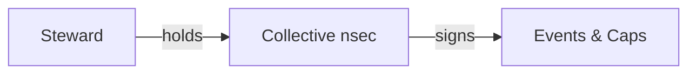

**Pros**: Simple, works now
**Cons**: Single point of failure, trust required

### Option 2: NIP-46 Bunker

Nsec stored in a bunker with policy engine.

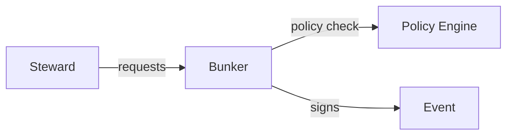

**Pros**: Better security, policy enforcement
**Cons**: More infrastructure, still centralized key

### Option 3: Threshold Signing (Frostr/FROST)

M-of-N stewards required to sign.

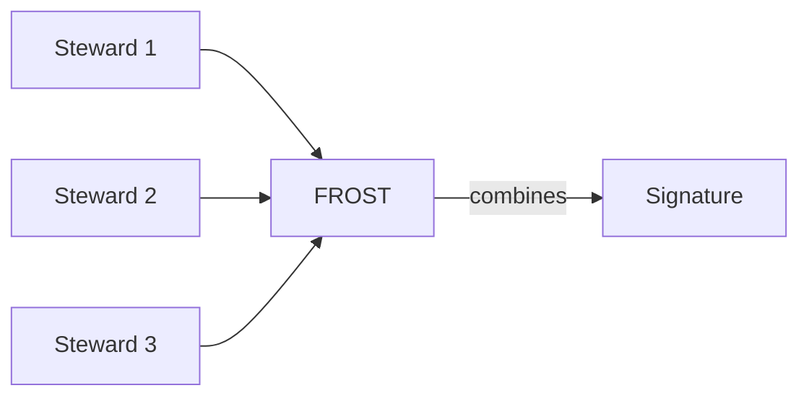

**Pros**: No single point of failure, true collective control
**Cons**: Complex, still experimental (Frostr is alpha)

### Recommendation

Start with NIP-46 bunker for production use. Migrate to Frostr when stable for high-stakes collectives.

## Collectives Bunker

A **Collectives Bunker** is a NIP-46 compatible remote signer designed specifically for group identity management. Unlike personal bunkers (nsecBunker, Amber) which assume one user managing their own keys, a Collectives Bunker manages multiple collective nsecs with steward-based authorization.

### Motivation

Existing bunkers assume `identity = individual`. They lack:
- Multi-collective key management (one bunker, many groups)
- Steward-based authorization (Nostr npubs as access control)
- Policy enforcement for collective operations (cap issuance rules)
- Collective-aware audit logging

A purpose-built Collectives Bunker fills this gap and could serve any Nostr project needing group identity—not just Socialroots.

### Core Capabilities

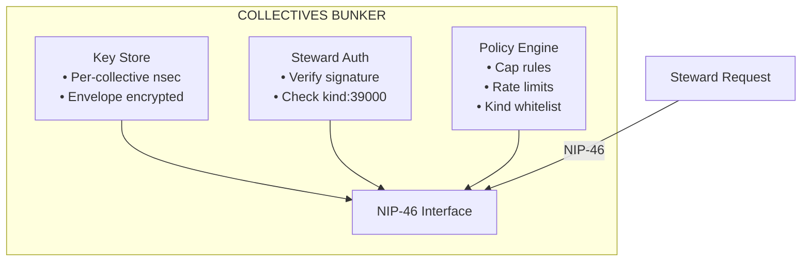

| Component | Responsibility |
|-----------|----------------|
| **Key Store** | Secure storage of collective nsecs (envelope encryption) |
| **Steward Auth** | Verify requesting npub is a steward for the target collective |
| **Policy Engine** | Enforce signing rules (allowed kinds, rate limits, cap issuance) |
| **NIP-46 Interface** | Standard remote signing protocol for interoperability |

### NIP-46 Interface Design

The Collectives Bunker uses **standard NIP-46** with one key insight: the **collective's npub is the remote-signer-pubkey**. This requires zero protocol changes.

#### Connection Model

In standard NIP-46, a client connects to a bunker's npub. For collectives, the steward connects directly to the collective's npub, which the bunker manages:

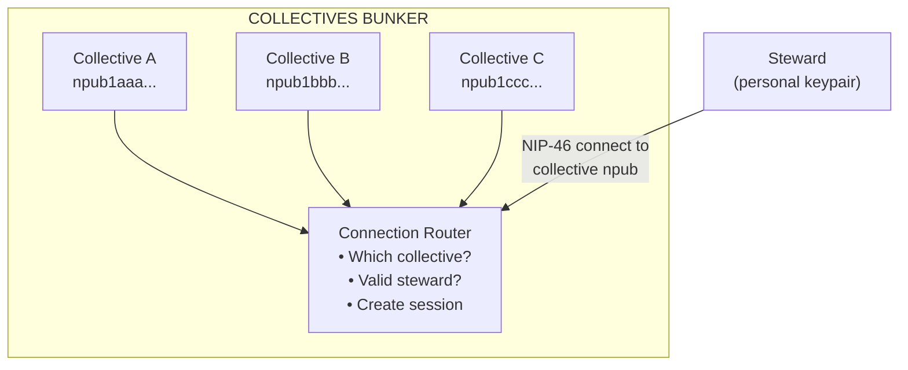

#### Connection URI

Standard `nostrconnect://` URI, where the target is the collective's npub:

```
nostrconnect://<collective_npub>?relay=wss://bunker.example.com&secret=...
```

The steward's client connects using the steward's personal keypair. The bunker validates that the connecting pubkey is authorized for the target collective.

#### Connection Flow

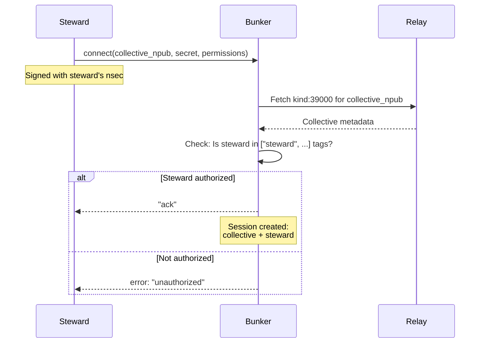

#### Signing Flow

Once connected, all `sign_event` calls use the session's collective nsec:

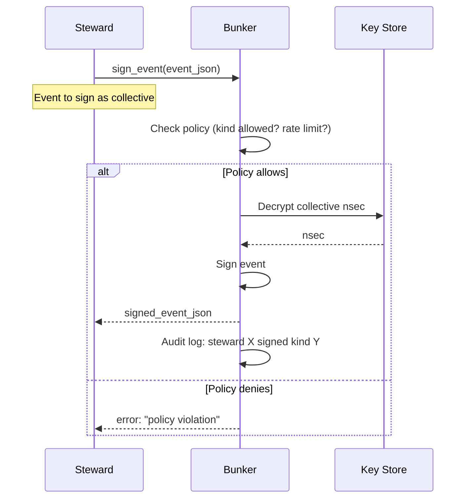

#### Why This Works

| Aspect | Standard NIP-46 | Collectives Bunker |
|--------|-----------------|-------------------|
| Connect to | Bunker's npub | Collective's npub |
| Who signs connection | User | Steward |
| Who signs events | Bunker (user's key) | Bunker (collective's key) |
| Bunker holds | One nsec | Many nsecs (per collective) |

The bunker is a **multi-tenant NIP-46 server** listening on multiple npubs (one per collective it manages).

### Authorization Flow

1. Steward connects via NIP-46 to collective's npub (not bunker's npub)
2. Bunker receives connection, identifies target collective
3. Bunker fetches collective's kind:39000 metadata
4. Bunker verifies connecting npub is in `["steward", "<npub>"]` tags
5. Session established, scoped to that collective
6. On `sign_event`: check policy, decrypt nsec, sign, return
7. Log action for audit trail

### Policy Examples

| Policy | Description |
|--------|-------------|
| **Kind whitelist** | Collective X can only sign kind:1, kind:30023 |
| **Cap issuance rules** | Only stewards can issue kind:39100 caps |
| **Rate limiting** | Max 100 signatures per hour per collective |
| **Time-based** | Signing only allowed during business hours |
| **Approval workflow** | High-stakes actions require M-of-N steward approval |

### Ecosystem Value

A Collectives Bunker is a standalone contribution to Nostr:

| Beneficiary | Value |
|-------------|-------|
| **Nostr ecosystem** | First bunker for group identity; enables new use cases |
| **NIP-29/72 communities** | Path to portable group identity |
| **Media organizations** | Shared publishing accounts with access control |
| **DAOs/cooperatives** | On-chain governance with Nostr identity |
| **Socialroots** | SR-NOSTR-GATEWAY becomes a thin client |

### Relationship to Existing Tools

| Tool | Relationship |
|------|--------------|
| **nsecBunker** | Inspiration; personal focus vs collective focus |
| **Frostr** | Complementary; bunker can delegate to Frostr for threshold signing |
| **NDK/nostr-tools** | Clients use these to connect to bunker |
| **Relays** | Bunker publishes signed events to relays |

### Open Questions

1. **Steward bootstrapping**: How does first steward get registered?
2. **Bunker federation**: Can multiple bunkers serve one collective?
3. **Offline stewards**: Caching/delegation for unavailable stewards?
4. **Policy language**: Standard format for policy definitions?

## Backwards Compatibility

Collectives are just npubs. Existing clients:

| Action | Compatibility |
|--------|---------------|
| Follow collective | Works (standard follow) |
| Display posts | Works (standard events) |
| Show profile | Works (standard kind:0) |
| Verify signatures | Works (standard secp256k1) |

New features (caps, commons) require updated clients/relays.

## Open Questions

1. **Steward changes**: How to add/remove stewards without key rotation?
2. **Collective dissolution**: What happens to content when collective ends?
3. **Collective forking**: Can a collective split into two?
4. **Identity continuity**: If key is compromised, how to migrate?
5. **Discovery**: How do clients discover that an npub is a collective?

## Event Kinds

| Kind | Description |
|------|-------------|
| 0 | Collective profile (standard) |
| 39000 | Collective metadata |

## See Also

- [NIP-29: Relay-based Groups](https://github.com/nostr-protocol/nips/blob/master/29.md)
- [NIP-46: Nostr Connect](https://github.com/nostr-protocol/nips/blob/master/46.md)
- [Frostr Project](https://github.com/frostr)

---

## Appendix: Ecosystem Tools for Key Management

This appendix surveys existing Nostr identity tools that can be leveraged for collective key management, avoiding unnecessary reinvention.

### A.1 NIP-46 Bunkers

#### nsecBunker

Self-hosted daemon for remote signing with policy engine.

| Aspect | Details |
|--------|---------|
| Repository | [kind-0/nsecbunkerd](https://github.com/kind-0/nsecbunkerd) |
| Language | TypeScript |
| Features | Multi-key storage, permission tokens, team access, revocable access |

**Relevance to Collectives**:
- Designed for shared accounts and team access
- Permission tokens map conceptually to NosCAP
- Can store multiple nsecs (per-collective keys)
- Would need extension for kind:39100 cap issuance logic

#### Nsec.app

Web-based non-custodial key storage with remote signing.

| Aspect | Details |
|--------|---------|
| URL | [nsec.app](https://nsec.app/) |
| Use case | Testing, lightweight deployments |

### A.2 Threshold Signing

#### Frostr (FROST Protocol)

M-of-N threshold signing using FROST (Flexible Round-Optimized Schnorr Threshold).

| Aspect | Details |
|--------|---------|
| Organization | [FROSTR-ORG](https://github.com/FROSTR-ORG/) |
| Status | Alpha, funded by OpenSats (2025) |
| Key innovation | Key rotation without changing npub |

**Tools in development**:
- **Igloo** - Desktop app for key splitting and remote signing
- **Frost2x** - Browser extension with FROST support
- **Heimdall** - REST API for signing (planned)
- **NIP-46 bridge** - Compatibility layer (planned)

**Relevance to Collectives**:
- True collective control (multiple stewards hold shares)
- No single point of failure
- Key rotation without identity change
- Best suited for high-stakes collectives (Phase 3+)

### A.3 Development Libraries

#### go-nostr (Go)

| Aspect | Details |
|--------|---------|
| Repository | [nbd-wtf/go-nostr](https://github.com/nbd-wtf/go-nostr) |
| Key interface | `Signer { GetPublicKey(), SignEvent() }` |
| Note | Maintenance mode; see also `fiatjaf.com/nostr` |

**Relevance**: Native Go library for SR-NOSTR-GATEWAY. Provides event signing primitives; NIP-46 server logic must be built on top.

#### NDK (TypeScript)

| Aspect | Details |
|--------|---------|
| Repository | [nostr-dev-kit/ndk](https://github.com/nostr-dev-kit/ndk) |
| Platforms | Web, React Native, Mobile |
| Signer support | Private key, NIP-07, NIP-46 |

**Relevance**: Recommended for client-side (sr-web). Built-in `loginWithNip46` for connecting to collective bunkers.

#### nostr-tools (TypeScript)

| Aspect | Details |
|--------|---------|
| Repository | [nbd-wtf/nostr-tools](https://github.com/nbd-wtf/nostr-tools) |
| NIP-46 module | `@nostr/tools/nip46` with `BunkerSigner` |

**Relevance**: Lower-level alternative to NDK for custom NIP-46 flows.

### A.4 Mobile Signers

#### Amber (Android)

| Aspect | Details |
|--------|---------|
| Repository | [greenart7c3/Amber](https://github.com/greenart7c3/Amber) |
| Protocols | NIP-46 (remote), NIP-55 (local Android) |
| Features | Multi-account, fine-grained app permissions |

**Relevance**: Stewards can use personal mobile device as signing device for collective operations.

### A.5 Recommended Integration Path

#### Phase 0-1: Single Custodian

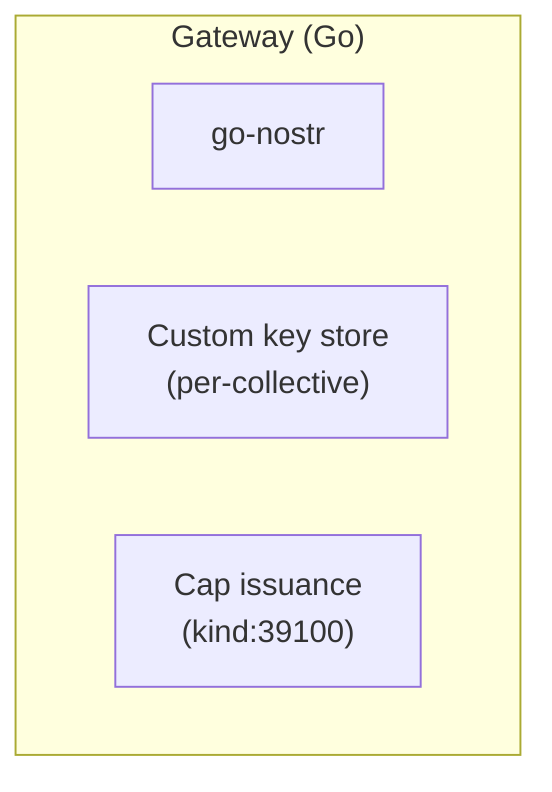

#### Phase 2: External Bunker

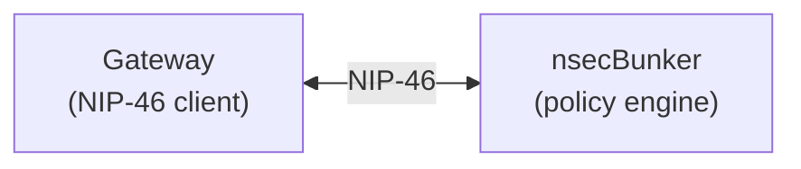

#### Phase 3+: Threshold Signing

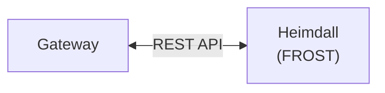

### A.6 Tool Selection Matrix

| Use Case | Recommended Tool |
|----------|-----------------|
| Gateway signing (Go backend) | go-nostr + custom NIP-46 |
| Client signing (Web/React) | NDK |
| Key custody (early phases) | nsecBunker or custom |
| Key custody (mature collectives) | Frostr/Heimdall |
| Steward mobile signing | Amber |

### A.7 Secure Key Storage for Single Custodian

When a gateway holds collective nsecs (Phase 0-1), secure storage is critical. This section surveys established patterns.

#### Envelope Encryption (DEK/KEK Pattern)

Envelope encryption is an industry-standard pattern for data-at-rest encryption, used by AWS KMS, Google Cloud KMS, Azure Key Vault, and most database encryption systems.

**Core insight**: Encrypting many secrets with a single key is risky—one leak exposes everything. Instead, use two layers:

| Key Type | Purpose | Lifecycle |
|----------|---------|-----------|
| **DEK** (Data Encryption Key) | Encrypts individual nsec | One per collective, stored in DB (encrypted) |
| **KEK** (Key Encryption Key) | Encrypts DEKs | One per gateway, stored externally |

**Benefits**:
- Compromised DB alone yields nothing (DEKs are encrypted)
- KEK rotation only re-encrypts small DEKs, not all nsecs
- Per-collective DEKs limit blast radius

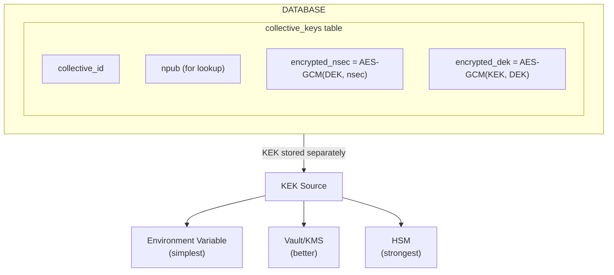

#### KEK Storage Options

| Option | Description | Trade-offs |
|--------|-------------|------------|
| **Environment variable** | KEK loaded from `GATEWAY_MASTER_KEY` | Simple; requires secure deployment |
| **HashiCorp Vault** | Open-source secrets management software | Self-hostable; operational overhead |
| **Cloud KMS** | AWS/GCP/Azure managed key service | Managed; cloud dependency |
| **HSM** | Hardware Security Module | Strongest; expensive, complex |

**HashiCorp Vault** deserves mention as it's open-source, self-hostable (fits decentralization ethos), and battle-tested. It can store the KEK and provide automatic key rotation.

#### Steward-Signed Authorization

Beyond encryption at rest, access control matters. A steward-signed request pattern ensures only authorized parties can trigger signing operations:

1. Steward sends a Nostr-signed request (NIP-46 style) to gateway
2. Gateway verifies signature against collective's steward list (from kind:39000 metadata)
3. Only if valid: gateway decrypts nsec and performs signing
4. All access logged for audit trail

**Benefits**:
- Authorization tied to Nostr identity (no separate auth system)
- Auditable (who requested what, when)
- No shared secrets between steward and gateway

#### nsecBunker's Approach

For reference, nsecBunker uses:
- Passphrase-based encryption (like LND wallet)
- Passphrase required on every daemon restart
- Whitelisted admin npubs for configuration
- All communication via encrypted Nostr events (NIP-46)

This is a viable model for simpler deployments where manual unlock on restart is acceptable.

#### Recommended Progression

| Phase | Storage | Authorization |
|-------|---------|---------------|
| 0 | Envelope encryption, env var KEK | Steward signature |
| 1 | Envelope encryption, Vault KEK | Steward signature + rate limiting |
| 2 | External nsecBunker | Delegated to bunker policies |
| 3+ | Frostr threshold | M-of-N steward signatures |
