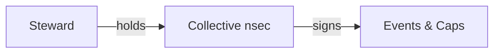
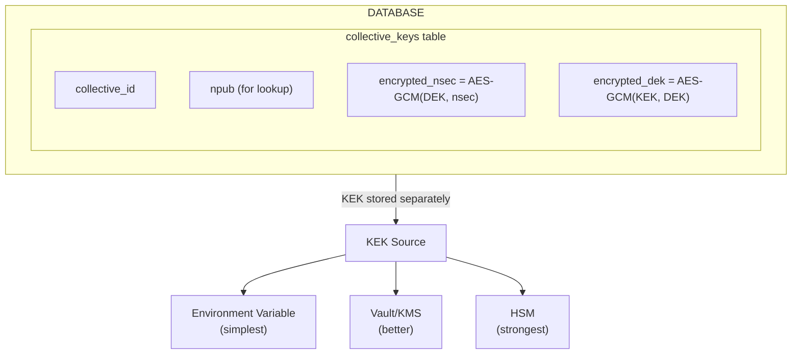
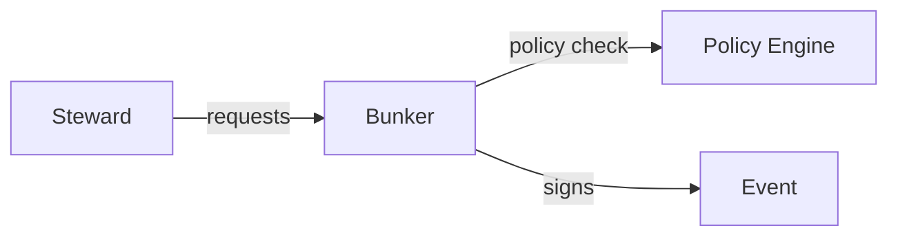
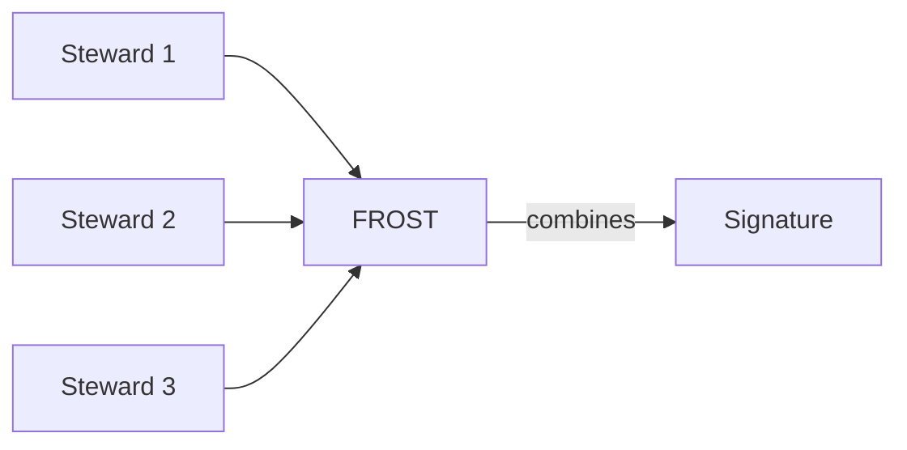

# NIP-A: Collective Identity

- **Status**: Draft
- **Depends on**: None
- **Required by**: [NIP-B (NosCAP)](NIP-B-NosCAP.md), [NIP-C (Commons Enforcement)](NIP-C-Commons-Enforcement.md)
- **Related**: [Policy-Based Signer](Policy-Based-Signer.md), [Overview](00-Overview.md)

## Summary

A **collective** is an npub that represents a group, organization, or multi-party entity. It has its own identity, publishes content, issues caps to members, and can connect with other collectives.

## Motivation

Nostr assumes `identity = individual`. This limits what groups can do:
- Groups can't speak with a collective voice
- Groups can't own portable identity
- Groups can't form relationships with other groups

By making collectives first-class npubs, we unlock collective agency while maintaining full backwards compatibility.

## Specification

### Collective Profile (kind:0)

Standard Nostr profile. No changes required.

```json
{
  "pubkey": "<collective_npub>",
  "kind": 0,
  "content": "{\"name\":\"Climate Action Network\",\"about\":\"A collective for climate activists\",\"picture\":\"https://...\"}",
  "created_at": 1704067200,
  "tags": [],
  "id": "...",
  "sig": "..."
}
```

### Collective Profile Extension

A collective's kind:0 profile can include a `collective` field in its content:

```json
{
  "pubkey": "<collective_npub>",
  "kind": 0,
  "content": "{\"name\":\"Climate Action Network\",\"about\":\"A collective for climate activists\",\"picture\":\"https://...\",\"collective\":{\"membership\":\"cap-based\"}}",
  "tags": [],
  "id": "...",
  "sig": "..."
}
```

| Field | Values | Description |
|-------|--------|-------------|
| `membership` | `cap-based`, `list-based`, `open` | How members join the collective |

Clients that don't understand the `collective` field ignore it. Clients that do can render the profile differently (e.g., show a group icon). Relay preferences use standard kind:10002 (NIP-65).

### Stewards

**Stewards** are members who hold broad CAPs (publish/\*, delegate/\*, etc.) granting them authority to:
- Sign events as the collective (via a [policy-based signer](Policy-Based-Signer.md))
- Issue and revoke caps
- Update collective profile and metadata
- Manage inter-collective relationships

A steward's actual power comes from the [capabilities](NIP-B-NosCAP.md) they hold — not from being on a list. However, a NIP-51 people list (kind:30000) published by the collective serves as a **discovery convenience**: it tells signers who to ask for approval, tells clients who to show as governance, and tells other collectives who to talk to.

```json
{
  "pubkey": "<collective_npub>",
  "kind": 30000,
  "tags": [
    ["d", "stewards"],
    ["p", "<steward1_npub>"],
    ["p", "<steward2_npub>"]
  ],
  "id": "...",
  "sig": "..."
}
```

A collective can publish additional lists with different `d` tags (e.g., `members`, `clients`).

## Key Management

### Option 1: Single Custodian

One steward holds the collective's nsec.


```mermaid
flowchart LR
    S["Steward"] -->|"holds"| N["Collective nsec"]
    N -->|"signs"| E["Events & Caps"]
```

**Pros**: Simple, works now
**Cons**: Single point of failure, trust required

If using a single custodian, the collective nsec SHOULD be stored using **envelope encryption** (DEK/KEK pattern) rather than plaintext or simple passphrase encryption. Each collective gets its own Data Encryption Key (DEK), which is itself encrypted by a Key Encryption Key (KEK) stored externally (environment variable, Vault, or KMS).


```mermaid
flowchart TB
    subgraph DB["DATABASE"]
        subgraph Table["collective_keys table"]
            CID["collective_id"]
            NPUB["npub (for lookup)"]
            ENSEC["encrypted_nsec = AES-GCM(DEK, nsec)"]
            EDEK["encrypted_dek = AES-GCM(KEK, DEK)"]
        end
    end

    DB -->|"KEK stored separately"| KEK["KEK Source"]

    KEK --> ENV["Environment Variable<br/>(simplest)"]
    KEK --> VAULT["Vault/KMS<br/>(better)"]
    KEK --> HSM["HSM<br/>(strongest)"]
```

This ensures a compromised database alone yields nothing, and per-collective DEKs limit blast radius.

### Option 2: NIP-46 Bunker

Nsec stored in a bunker with policy engine.


```mermaid
flowchart LR
    S["Steward"] -->|"requests"| B["Bunker"]
    B -->|"policy check"| P["Policy Engine"]
    B -->|"signs"| E["Event"]
```

**Pros**: Better security, policy enforcement
**Cons**: More infrastructure, still centralized key

### Option 3: Threshold Signing (Frostr/FROST)

M-of-N stewards required to sign.


```mermaid
flowchart LR
    S1["Steward 1"] --> F["FROST"]
    S2["Steward 2"] --> F
    S3["Steward 3"] --> F
    F -->|"combines"| Sig["Signature"]
```

**Pros**: No single point of failure, true collective control
**Cons**: Complex, still experimental (Frostr is alpha)

### Recommendation

Start with NIP-46 bunker for production use. Migrate to Frostr when stable for high-stakes collectives.

## Policy-Based Signer

The recommended approach for collective key management is a **policy-based signer** (like [Keycast](https://github.com/erskingardner/keycast)) — a NIP-46 compatible remote signer that enforces a structured, owner-co-signed policy published as a Nostr event (kind:39050). This design supports multi-tenant key storage, steward-based approval workflows, and is portable across signer implementations.

See [Policy-Based Signer](Policy-Based-Signer.md) for the full design draft, including event kinds, policy schema, and bootstrap lifecycle.

## Backwards Compatibility

Collectives are just npubs. Existing clients:

| Action | Compatibility |
|--------|---------------|
| Follow collective | Works (standard follow) |
| Display posts | Works (standard events) |
| Show profile | Works (standard kind:0) |
| Verify signatures | Works (standard secp256k1) |

New features (caps, commons) require updated clients/relays.

## Event Kinds

| Kind | Description |
|------|-------------|
| 0 | Collective profile (standard, with optional `collective` field) |
| 30000 | Steward/member lists (NIP-51) |

## See Also

- [NIP-29: Relay-based Groups](https://github.com/nostr-protocol/nips/blob/master/29.md)
- [NIP-46: Nostr Connect](https://github.com/nostr-protocol/nips/blob/master/46.md)
- [NIP-51: Lists](https://github.com/nostr-protocol/nips/blob/master/51.md)
- [NIP-65: Relay List Metadata](https://github.com/nostr-protocol/nips/blob/master/65.md)
- [Frostr Project](https://github.com/frostr)
- [Comunikeys](https://nostrhub.io/naddr1qvzqqqrcvypzp22rfmsktmgpk2rtan7zwu00zuzax5maq5dnsu5g3xxvqr2u3pd7qyt8wumn8ghj7un9d3shjtnswf5k6ctv9ehx2aqqpahxjupdvdhk6mt4de5kketewv2v5xny)

