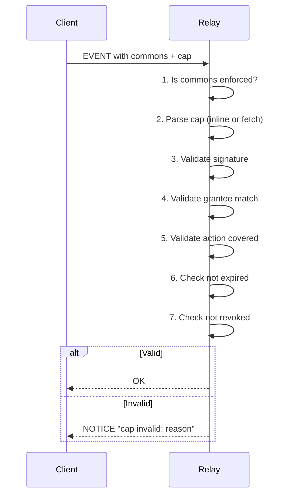

# NIP-C: Commons Enforcement

**Status**: Draft
**Depends on**: NIP-A (Collective Identity), NIP-B (NosCAP)

## Summary

A **commons** is the collection of events belonging to a collective. Relays validate caps before accepting events in commons they enforce. This shifts access control from "pubkey allowlists" to "cap validation."

## Motivation

Without relay enforcement:
- Anyone can claim to post in a collective's commons
- Caps are just metadata with no enforcement
- Collectives have no control over their commons

Relay enforcement makes commons meaningful: only authorized members can publish.

## Specification

### Commons Tag

Events in a collective's commons include the `commons` tag:

```json
{
  "pubkey": "<member_npub>",
  "kind": 1,
  "tags": [
    ["commons", "<collective_npub>"],
    ["cap", "<cap_reference>"]
  ],
  "content": "Content in the collective's commons"
}
```

### Ownership Rules

| Condition | Cap Required? |
|-----------|---------------|
| `pubkey == collective_npub` | No (collective posting directly) |
| `pubkey != collective_npub` | Yes (member needs cap) |

### Cap Attachment

Events must include cap reference:

**Option A: Event ID reference**
```json
["cap", "<cap_event_id>", "wss://relay.example.com"]
```

**Option B: Inline token**
```json
["cap", "noscap1<base64url_encoded_cap>"]
```

## Relay Configuration

Relays can enforce specific commons:

```json
{
  "enforced_commons": [
    {
      "collective": "<collective_npub>",
      "require_cap": true,
      "allowed_kinds": [1, 30023, 30078],
      "trust_stewards": ["<steward1_npub>", "<steward2_npub>"]
    }
  ],
  "default_policy": "accept"  // or "reject" for strict relays
}
```

**Configuration options**:
- `collective` - The collective's npub
- `require_cap` - Whether caps are required for this commons
- `allowed_kinds` - Event kinds allowed in this commons
- `trust_stewards` - Additional stewards relay trusts (beyond metadata)
- `default_policy` - What to do for unconfigured commons

## Validation Flow



### Validation Steps

1. **Commons check**: Is this commons enforced by this relay?
2. **Pubkey check**: If pubkey == collective, accept (no cap needed)
3. **Cap parse**: Extract cap from tag (fetch if referenced)
4. **Signature check**: Was cap signed by the collective, a steward, or valid delegator?
5. **Grantee check**: Does cap grantee match event pubkey?
6. **Action check**: Does cap authorize this kind?
7. **Expiry check**: Is cap still valid (not expired)?
8. **Revocation check**: Has cap been revoked?

### Error Responses

```
NOTICE "cap required: commons <collective_npub> is enforced"
NOTICE "cap invalid: signature verification failed"
NOTICE "cap invalid: grantee mismatch"
NOTICE "cap invalid: action not authorized for kind:1"
NOTICE "cap invalid: expired"
NOTICE "cap invalid: revoked"
```

## Indexing

Relays index events by commons for efficient queries:

```json
// Query all events in a collective's commons
{
  "kinds": [1],
  "#commons": ["<collective_npub>"]
}

// Query all events in commons by specific author
{
  "kinds": [1],
  "#commons": ["<collective_npub>"],
  "authors": ["<member_npub>"]
}
```

## NIP-42 AUTH Extension

For private commons, extend AUTH with cap:

```json
// Standard NIP-42 challenge
["AUTH", "<challenge>"]

// Response with cap for commons access
{
  "kind": 22242,
  "tags": [
    ["relay", "wss://relay.example.com"],
    ["challenge", "<challenge>"],
    ["cap", "<cap_reference>"]
  ]
}
```

This allows relays to verify read access for private commons.

## Performance Considerations

### Cap Caching

Relays should cache validated caps:
- Key: cap event ID
- Value: parsed cap + validation result
- TTL: min(cap expiry, 1 hour)

### Chain Depth Limits

For delegation chains, recommend max depth of 3-5 to bound validation time.

### Batch Validation

When processing multiple events from same member, reuse cap validation result.

## Relationship to Existing NIPs

| NIP | Relationship |
|-----|--------------|
| NIP-01 | Standard event structure |
| NIP-29 | Compatible - relay groups can adopt commons |
| NIP-42 | Extended for cap-based AUTH |
| NIP-65 | Collectives advertise supporting relays |
| NIP-72 | Communities can adopt commons |

## Open Questions

1. **Cross-relay validation**: Can relay A validate cap stored only on relay B?
2. **Performance**: What's the overhead for high-volume commons?
3. **Partial enforcement**: Should relays enforce some commons but not others?
4. **Gossip**: How do relays learn about revocations?
5. **Migration**: How to transition existing NIP-29 groups?

## Event Kinds

No new kinds. This NIP defines relay behavior for:
- Events with `["commons", "..."]` tag
- NIP-42 AUTH with cap attachment

## See Also

- [NIP-29: Relay-based Groups](https://github.com/nostr-protocol/nips/blob/master/29.md)
- [NIP-42: Authentication](https://github.com/nostr-protocol/nips/blob/master/42.md)
- [NIP-65: Relay List Metadata](https://github.com/nostr-protocol/nips/blob/master/65.md)
