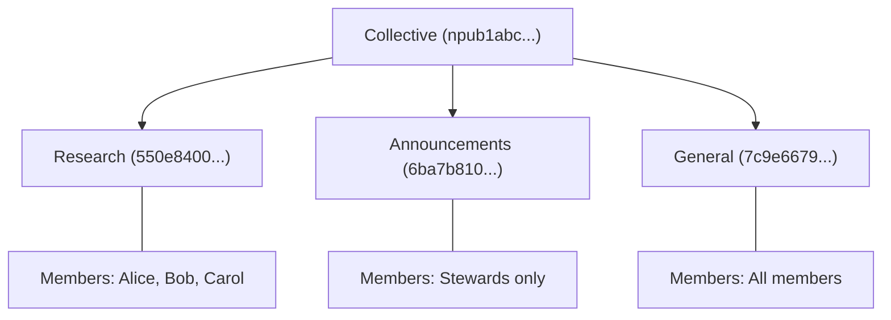
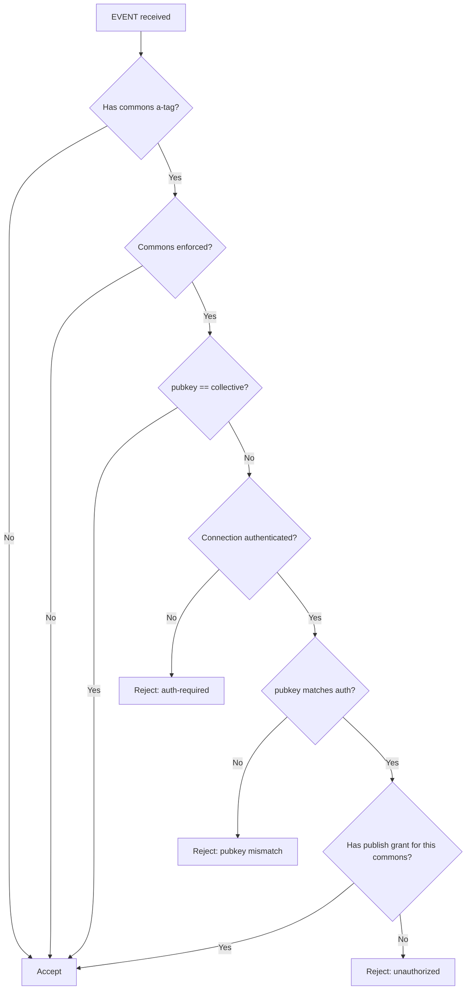
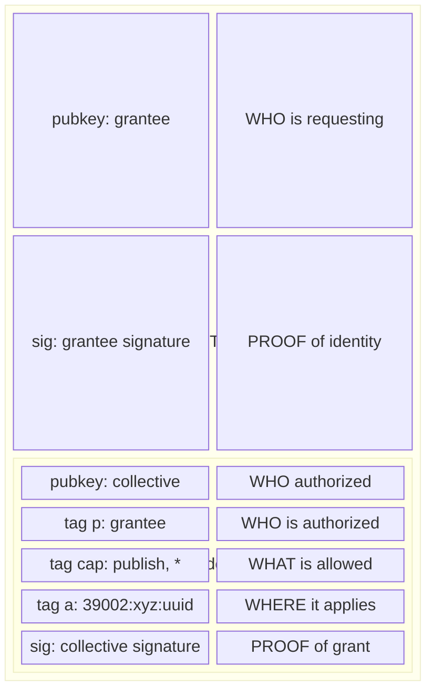
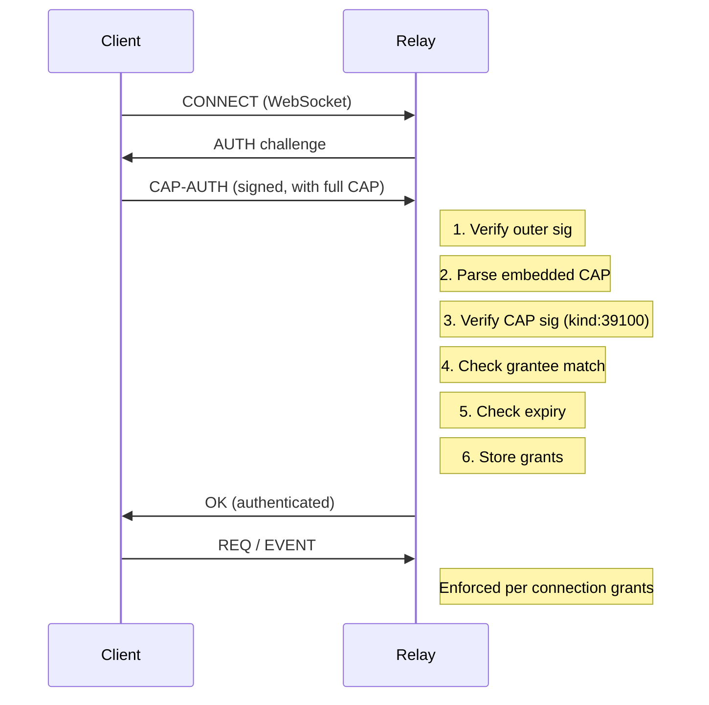

# NIP-C: Commons Enforcement

**Status**: Draft
**Depends on**: NIP-A (Collective Identity), NIP-B (NosCAP)

## Summary

A **commons** is a named space within a collective where members can publish content. Each commons is an addressable event (kind:39002) that can have its own membership via caps. Relays validate caps before accepting events in commons they enforce.

## Motivation

Without relay enforcement:
- Anyone can claim to post in a collective's commons
- Caps are just metadata with no enforcement
- Collectives have no control over their spaces

Relay enforcement makes commons meaningful: only authorized members can publish.

## Specification

### Commons Definition (kind:39002)

A commons is defined as an addressable event:

```json
{
  "pubkey": "<collective_npub>",
  "kind": 39002,
  "tags": [
    ["d", "<uuid>"]
  ],
  "content": "{
    \"name\": \"Research Commons\",
    \"about\": \"Space for research discussions\",
    \"picture\": \"https://example.com/research.png\",
    \"relays\": [\"wss://relay.example.com\"]
  }",
  "created_at": 1704067200,
  "id": "...",
  "sig": "..."
}
```

**Fields in content (JSON)**:
| Field | Required | Description |
|-------|----------|-------------|
| `name` | Yes | Human-readable name |
| `about` | No | Description |
| `picture` | No | Avatar/icon URL |
| `relays` | No | Preferred relays for this commons |

**Why UUID for d-tag?**
- Guaranteed unique
- Rename-safe (name can change, ID stays)
- Simple to generate (`crypto.randomUUID()`)

### Multiple Commons per Collective

A collective can have multiple commons with different purposes:



### Referencing Commons (NIP-33 `a` tag)

Events reference commons using the standard `a` tag for addressable events:

```json
{
  "pubkey": "<member_npub>",
  "kind": 1,
  "tags": [
    ["a", "39002:<collective_npub>:<uuid>"]
  ],
  "content": "Content in the commons"
}
```

**Benefits of `a` tag**:
- Standard NIP-33 pattern
- Already indexed by relays
- No new infrastructure needed
- Works with existing filters: `#a`

> **Note**: Events do NOT carry a CAP tag. Authorization is handled at the connection level via CAP-AUTH (see below), not per-event.

### Ownership Rules

| Condition | Cap Required? |
|-----------|---------------|
| `pubkey == collective_npub` | No (collective posting directly) |
| `pubkey != collective_npub` | Yes (member needs cap) |

## Commons Auto-Registration

When a relay receives a valid `kind:39002` event, it automatically registers that commons for enforcement. Any subsequent read/write to that commons requires appropriate CAP-AUTH.

```javascript
// Relay auto-registers commons on receipt
if (event.kind === 39002) {
  const uuid = event.tags.find(t => t[0] === "d")?.[1]
  enforcedCommons.add(`39002:${event.pubkey}:${uuid}`)
}
```

No static configuration file is needed — commons are enforced as soon as they are created.

## Enforcement

Authorization is checked at two points: **write** (EVENT) and **read** (REQ). Both use the grants stored during CAP-AUTH (see below).

### Write Enforcement (EVENT)



### Read Enforcement (REQ)

For subscriptions, the relay silently filters events the connection cannot access:

- Events without a commons `a` tag: always included
- Events in non-enforced commons: always included
- Events in enforced commons: included only if the connection has `access` or `publish` grants for that commons

### Error Responses

Write rejections use the standard `OK` message with an error prefix:

```json
["OK", "<event_id>", false, "auth-required: this commons requires CAP authentication"]
["OK", "<event_id>", false, "restricted: no publish permission for this commons"]
```

## Querying Commons Content

Using standard NIP-33 `#a` filter (already supported by relays):

```json
// Query all events in a specific commons
{
  "kinds": [1],
  "#a": ["39002:<collective_npub>:<uuid>"]
}

// Query events in commons by specific author
{
  "kinds": [1],
  "#a": ["39002:<collective_npub>:<uuid>"],
  "authors": ["<member_npub>"]
}

// Query all commons definitions for a collective
{
  "kinds": [39002],
  "authors": ["<collective_npub>"]
}
```

## CAP-AUTH: Self-Contained Authorization

For both **read** (subscriptions) and **write** (publishing) access to protected commons, clients authenticate once per connection by presenting a **self-contained CAP-AUTH event**. This extends NIP-42 with embedded capability proof.

The client embeds the **full CAP** in a signed AUTH event. The relay validates both signatures in one step — no fetching, no external dependencies, everything needed is in the message.

### CAP-AUTH Event Structure

```json
{
  "kind": 22242,
  "pubkey": "<grantee_pubkey>",
  "created_at": 1704067200,
  "tags": [
    ["relay", "wss://relay.example.com"],
    ["challenge", "<relay_challenge>"],
    ["cap", "<full_cap_event_as_json>"]
  ],
  "content": "",
  "sig": "<grantee_signature>"
}
```

The `cap` tag contains the **full CAP event as JSON**, not just a reference:

```json
["cap", "{\"kind\":39100,\"pubkey\":\"<collective>\",\"tags\":[[\"p\",\"<grantee>\"],[\"cap\",\"publish\",\"*\"],[\"a\",\"39002:<collective>:*\"]],\"sig\":\"...\"}"]
```

### Two Signatures, One Message

| Signature | Proves |
|-----------|--------|
| **Outer** (AUTH event) | Sender is the grantee pubkey |
| **Inner** (embedded CAP) | Collective authorized this grantee |



### Relay Validation (Simple!)

```javascript
function validateCapAuth(authEvent) {
  // 1. Verify outer signature (proves sender owns pubkey)
  if (!verifySignature(authEvent))
    return { ok: false, reason: "invalid auth signature" }

  // 2. Extract embedded CAP
  const capJson = authEvent.tags.find(t => t[0] === 'cap')?.[1]
  const cap = JSON.parse(capJson)

  // 3. Verify CAP signature (proves collective issued it)
  if (!verifySignature(cap))
    return { ok: false, reason: "invalid cap signature" }

  // 4. Check grantee matches auth pubkey
  const grantee = cap.tags.find(t => t[0] === 'p')?.[1]
  if (grantee !== authEvent.pubkey)
    return { ok: false, reason: "grantee mismatch" }

  // 5. Check not expired
  const expiry = cap.tags.find(t => t[0] === 'expiry')?.[1]
  if (expiry && parseInt(expiry) < Date.now() / 1000)
    return { ok: false, reason: "cap expired" }

  // 6. Store grants for this connection
  return {
    ok: true,
    pubkey: authEvent.pubkey,
    grants: parseGrants(cap)
  }
}
```

### Connection State After AUTH

Once validated, the relay stores the connection's grants as a flat list:

```javascript
connections.set(socketId, {
  pubkey: "grantee_abc123",
  grants: [
    { action: "publish", scope: "*", commons: "39002:collective_xyz:uuid" },
    { action: "access", scope: "*", commons: "39002:collective_xyz:uuid" }
  ]
})
```

Each grant has an `action` (publish, access), a `scope` (event kind or `*` for all), and the `commons` reference it applies to.

### Full Flow



## Relationship to Existing NIPs

| NIP | Relationship |
|-----|--------------|
| NIP-01 | Standard event structure |
| NIP-11 | Relay information document (relay should advertise NIP-42 support) |
| NIP-29 | Compatible - relay groups can adopt commons |
| NIP-33 | Uses addressable events pattern |
| NIP-42 | Extended for CAP-based AUTH |
| NIP-65 | Collectives advertise supporting relays |

## Open Questions

1. **Gossip**: How do relays learn about revocations?
2. **Migration**: How to transition existing NIP-29 groups?
3. **Commons discovery**: Should commons definitions be published to relays or kept private?

## Future Work

- **CAP revocation** (`kind:39101`): Relays should check revocation status during AUTH validation
- **Delegation chains**: Validate `parent` tag chains with depth limits (3-5 max)
- **CAP kind validation**: Verify embedded CAP is `kind:39100` (not just any signed event)
- **`relay` tag validation**: Check AUTH event `relay` tag matches to prevent cross-relay replay
- **`delete` action enforcement**: Separate grant for `kind:5` deletion events

## Event Kinds

| Kind | Description |
|------|-------------|
| 39002 | Commons definition |
| 22242 | CAP-AUTH event (NIP-42 extension) |

## See Also

- [NIP-29: Relay-based Groups](https://github.com/nostr-protocol/nips/blob/master/29.md)
- [NIP-33: Parameterized Replaceable Events](https://github.com/nostr-protocol/nips/blob/master/33.md)
- [NIP-42: Authentication](https://github.com/nostr-protocol/nips/blob/master/42.md)
- [NIP-65: Relay List Metadata](https://github.com/nostr-protocol/nips/blob/master/65.md)
