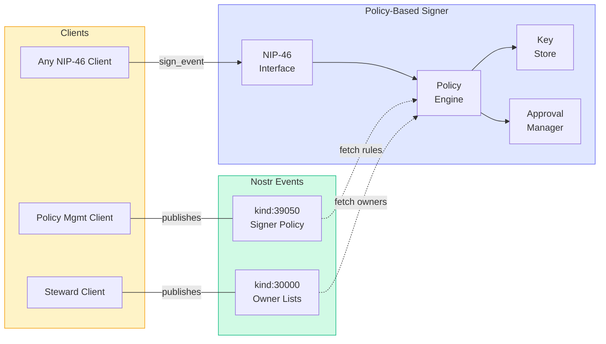
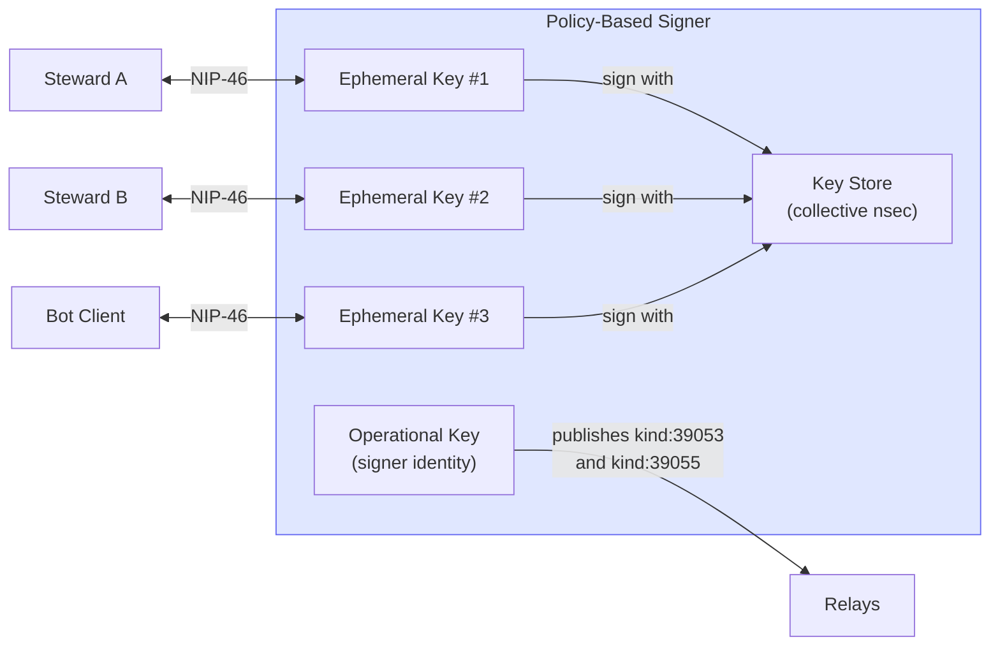
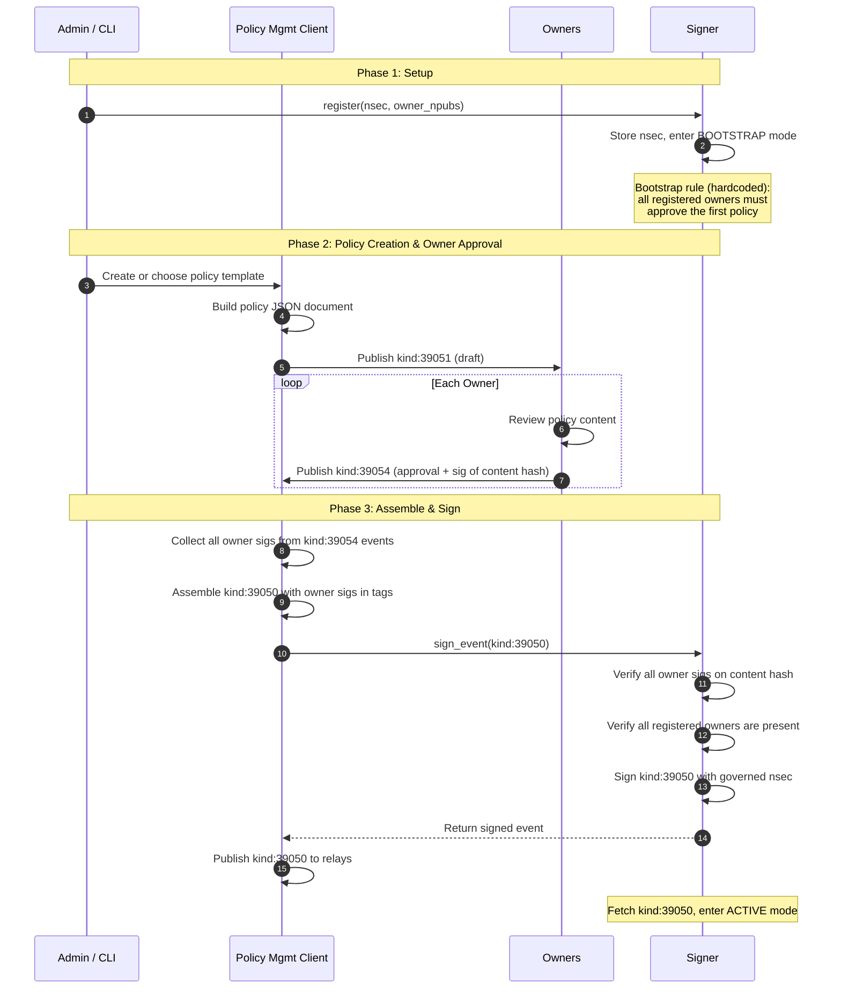
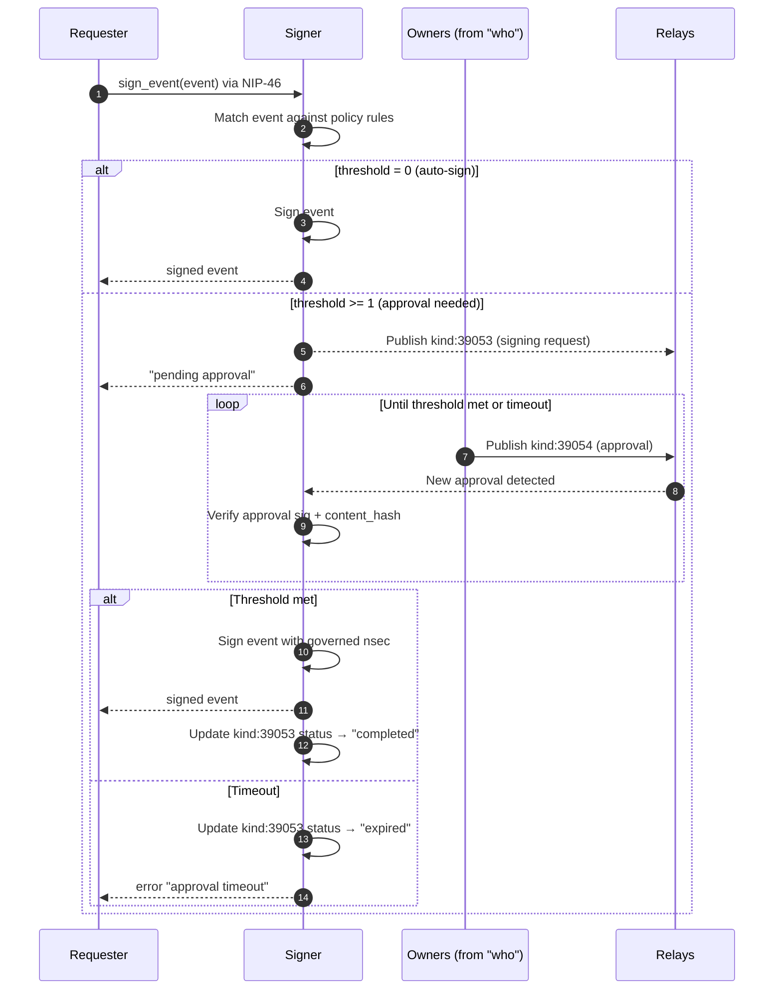

# Policy-Based Signer

**Status**: Draft
**Depends on**: NIP-A (Collective Identity), NIP-B (NosCAP)
**Related**: NIP-46 (Nostr Remote Signing)
**Inspired by**: [Keycast](https://github.com/erskingardner/keycast) ([dcadenas fork](https://github.com/dcadenas/keycast)) — a production NIP-46 multi-tenant signer with team-based policies. Several aspects of this spec (per-authorization ephemeral keypairs, match conditions, signing activity logging) are informed by Keycast's design. The dcadenas fork adds OAuth 2.0 with PKCE, email/password auth, and signer auto-scaling via consistent hashing.

## Summary

A **policy-based signer** is a NIP-46 compatible remote signer that enforces a structured signing policy before producing signatures. The policy is a Nostr event co-signed by key owners, making it portable across signer implementations and verifiable by anyone.

This design is **not specific to collectives** — individuals can use the same mechanism to govern their personal keys. Collectives are the motivating use case, but the protocol works for any npub.

## Motivation

Existing Nostr signers (NIP-07 extensions, NIP-46 bunkers, mobile signers) assume a single user managing their own key. They lack:

| Gap | Description |
|-----|-------------|
| **Multi-owner governance** | No mechanism for multiple parties to control signing |
| **Structured policy** | Permissions are ad-hoc (per-app toggles, not per-action rules) |
| **Policy portability** | Switching signers means reconfiguring everything from scratch |
| **Auditable agreement** | No proof that key owners agreed to the signing rules |

A policy-based signer closes these gaps by separating **policy** (what should be signed, who must approve) from **enforcement** (the signer software that holds the key).

## Architecture Overview



**Key principle**: The signer holds the nsec but is **not the source of truth** for identity, ownership, or policy. All of that lives on Nostr as events published by the governed npub. The signer reads and enforces; it does not define.

**Multi-tenancy**: A single signer instance can manage multiple governed npubs (e.g., several collectives). Each governed npub is fully isolated — its own policy (kind:39050), its own owner list (kind:30000), its own key in the key store, and its own set of ephemeral session keypairs. A signing request for collective A cannot be approved by owners of collective B, even if both are hosted on the same signer.

## Components

### Signer Policy (kind:39050)

A parameterized replaceable event published by the governed npub. The `content` field contains a JSON policy document. Each owner's signature over the content is embedded in `owner` tags.

```json
{
  "pubkey": "<governed_npub>",
  "kind": 39050,
  "tags": [
    ["d", "signer-policy"],
    ["v", "1"],
    ["signer", "<signer_operational_pubkey>"],
    ["owner", "<owner_A_hex>", "<sig_of_content_hash>"],
    ["owner", "<owner_B_hex>", "<sig_of_content_hash>"],
    ["owner", "<owner_C_hex>", "<sig_of_content_hash>"],
    ["encrypted", "false"]
  ],
  "content": "<JSON policy document (see below)>"
}
```

Each `owner` tag contains a Schnorr signature over `sha256(content)`, produced with the owner's personal nsec. A signer MUST verify all owner signatures before enforcing the policy.

#### Privacy

For sensitive policies, the `content` can be NIP-44 encrypted from the governed npub to itself (`"encrypted": "true"`). The signer (holding the nsec) can decrypt it. Owner signatures are over the **plaintext hash**, so they remain verifiable during the draft/approval phase even though the published content is encrypted.

#### Per-Authorization Ephemeral Keypairs

The signer SHOULD generate a **separate ephemeral keypair for each NIP-46 session** (each client or steward connection). The governed nsec is only used internally to sign events — it never appears in the NIP-46 transport layer.

```
Steward A ←── NIP-46 via ephemeral key #1 ──→ Signer ──→ signs with governed nsec
Steward B ←── NIP-46 via ephemeral key #2 ──→ Signer ──→ signs with governed nsec
Bot Client ←── NIP-46 via ephemeral key #3 ──→ Signer ──→ signs with governed nsec
```

Each session gets a unique bunker URL: `bunker://<ephemeral_pubkey>?relay=...&secret=...`



This enables:
- **Granular revocation**: Deleting ephemeral key #2 cuts off Steward B without affecting other sessions
- **Session isolation**: A leaked bunker URL compromises one session, not all
- **Per-session policy scoping**: Different authorizations can reference different policy rules (e.g., a bot client gets auto-sign for kind:1, while stewards go through approval for kind:39100)

#### Operational Keypair (Signer Identity)

Separate from the per-session ephemeral keys, the signer maintains a stable **operational keypair** used to publish protocol events (kind:39053 signing requests, kind:39055 activity logs). This gives the signer a verifiable identity so that:

- Owners can confirm a signing request came from the signer they trust, not a random key
- Activity logs are attributable to a specific signer instance
- Migration to a new signer is visible in the event trail

The signer's operational pubkey is recorded in the policy event via a `["signer", "<operational_pubkey>"]` tag (see kind:39050 below), binding the signer's identity to the policy that owners co-signed.

### Owner Lists (kind:30000 — NIP-51)

Owners are defined via NIP-51 people lists published by the governed npub:

```json
{
  "pubkey": "<governed_npub>",
  "kind": 30000,
  "tags": [
    ["d", "stewards"],
    ["p", "<steward_A_hex>"],
    ["p", "<steward_B_hex>"],
    ["p", "<steward_C_hex>"]
  ]
}
```

A single npub can publish multiple lists with different `d` tags (`stewards`, `clients`, `members`). Policy rules reference lists using the NIP-33 address format: `30000:<pubkey_hex>:<d_tag>`.

### Signing Request (kind:39053)

When a signing operation requires approval, the signer publishes a request:

```json
{
  "pubkey": "<signer_npub>",
  "kind": 39053,
  "tags": [
    ["d", "<request_uuid>"],
    ["p", "<governed_npub>"],
    ["p", "<owner_A_hex>"],
    ["p", "<owner_B_hex>"],
    ["event", "<JSON of the event to be signed>"],
    ["status", "pending"],
    ["expiry", "<unix_timestamp>"]
  ],
  "content": ""
}
```

The `event` tag contains the full JSON of the event awaiting signature. The signer `p`-tags all owners who need to be notified.

### Signing Approval (kind:39054)

Each owner publishes an approval (or rejection) as a parameterized replaceable event:

```json
{
  "pubkey": "<owner_A_hex>",
  "kind": 39054,
  "tags": [
    ["d", "<request_uuid>"],
    ["e", "<signing_request_event_id>"],
    ["p", "<governed_npub>"],
    ["content_hash", "<sha256 of the event JSON from the request>"],
    ["decision", "approve"]
  ],
  "content": ""
}
```

Using the request UUID as the `d` tag ensures each owner can have at most one approval per request (replaceable). The `content_hash` binds the approval to the exact event content — even if the signing request is tampered with, the approval only covers the hash the owner verified.

### Policy Draft (kind:39051) — Optional

A non-binding proposal for owners to discuss before submitting to a signer:

```json
{
  "pubkey": "<proposer_npub>",
  "kind": 39051,
  "tags": [
    ["d", "<draft_id>"],
    ["p", "<governed_npub>"],
    ["p", "<owner_A_hex>"],
    ["p", "<owner_B_hex>"]
  ],
  "content": "<JSON policy document>"
}
```

This is a coordination aid, not a protocol requirement. The signer does not consume this event.

### Signing Activity (kind:39055)

After each completed signing operation, the signer publishes an audit log entry:

```json
{
  "pubkey": "<signer_npub>",
  "kind": 39055,
  "tags": [
    ["p", "<governed_npub>"],
    ["p", "<requester_npub>"],
    ["e", "<signed_event_id>"],
    ["k", "<event_kind>"],
    ["rule", "<matched_rule_id>"],
    ["e", "<signing_request_event_id>"]
  ],
  "content": ""
}
```

| Tag | Description |
|-----|-------------|
| `p` (governed) | The npub whose nsec was used |
| `p` (requester) | Who requested the signature |
| `e` (signed) | The event that was signed |
| `k` | The kind of the signed event |
| `rule` | Which policy rule matched (references `id` field) |
| `e` (request) | The signing request event, if approval was required |

This is a regular (non-replaceable) event — each signing operation produces one. The signer MAY publish these to a private relay for the collective's records, or encrypt the content for restricted visibility.

## Policy Document Schema

The `content` field of kind:39050 is a JSON document:

```json
{
  "version": 1,
  "description": "Signing policy for Climate Action Network",
  "default": "deny",
  "rules": [
    {
      "id": "cap-issuance",
      "description": "Issue membership CAPs",
      "action": "sign",
      "kind": 39100,
      "who": "30000:<collective_hex>:stewards",
      "approval": {
        "threshold": 2,
        "timeout": 86400
      }
    },
    {
      "id": "cap-delegation",
      "description": "Issue CAPs with delegate power",
      "action": "sign",
      "kind": 39100,
      "match": { "tag:cap": "delegate" },
      "who": "30000:<collective_hex>:stewards",
      "approval": {
        "threshold": "all",
        "timeout": 172800
      }
    },
    {
      "id": "policy-change",
      "description": "Update signing policy",
      "action": "sign",
      "kind": 39050,
      "who": "30000:<collective_hex>:stewards",
      "approval": {
        "threshold": "all",
        "timeout": 172800
      }
    },
    {
      "id": "profile-update",
      "description": "Update collective profile",
      "action": "sign",
      "kind": 0,
      "who": "30000:<collective_hex>:stewards",
      "approval": {
        "threshold": 1
      }
    }
  ]
}
```

### Rule Fields

| Field | Required | Description |
|-------|----------|-------------|
| `id` | Yes | Unique rule identifier |
| `description` | Yes | Human-readable explanation (shown during approval) |
| `action` | Yes | Operation type: `sign`, `nip44_encrypt`, `nip44_decrypt`, `nip04_encrypt`, `nip04_decrypt` |
| `kind` | For `sign` | Event kind(s) this rule matches (integer or array of integers). Not applicable to encrypt/decrypt actions |
| `match` | No | Additional conditions: tag values (`tag:<name>`), content patterns (`content`), encryption target (`encrypt_to`). See Match Conditions below |
| `who` | Yes | Who can trigger this rule: an npub hex or a NIP-33 list reference |
| `approval.threshold` | Yes | Number of approvals required, or `"all"` |
| `approval.timeout` | No | Seconds to wait for approvals before expiring the request |

### Match Conditions

The `match` field supports three types of conditions:

| Condition | Applies to | Description | Example |
|-----------|-----------|-------------|---------|
| `tag:<name>` | `sign` | Match a specific tag value in the event | `"tag:cap": "delegate"` |
| `content` | `sign` | Regex pattern matched against event content | `"content": "^(kind1\|reaction)$"` |
| `encrypt_to` | `nip44_*`, `nip04_*` | Restrict encryption/decryption target | `"encrypt_to": "self"` |

Multiple conditions in a single `match` object are AND-ed — all must be satisfied.

**Examples**:

```json
// Only match CAPs that grant delegate power
"match": { "tag:cap": "delegate" }

// Only match notes that don't contain URLs
"match": { "content": "^[^http]*$" }

// Only allow encrypting/decrypting with self
"match": { "encrypt_to": "self" }

// Combined: CAPs granting delegate to a specific commons
"match": { "tag:cap": "delegate", "tag:a": "39002:<collective>:*" }
```

### Rule Matching

When the signer receives a NIP-46 request (`sign_event`, `nip44_encrypt`, `nip44_decrypt`, etc.):

1. Identify the requester (their npub from the NIP-46 session)
2. Identify the `action` (`sign`, `nip44_encrypt`, etc.)
3. For `sign` actions: identify the event's `kind`
4. Find all rules where `action` matches, `who` includes the requester, and (for `sign`) `kind` matches
5. If multiple rules match, select the **most specific** (rules with `match` conditions beat rules without)
6. If no rule matches → apply `default` (typically `"deny"`)

### Individual Use

The same schema works for a personal signer policy:

```json
{
  "version": 1,
  "description": "Personal signing policy for Alice",
  "default": "deny",
  "rules": [
    {
      "id": "social",
      "description": "Auto-sign notes and reactions",
      "action": "sign",
      "kind": [1, 7],
      "who": "<alice_npub_hex>",
      "approval": { "threshold": 0 }
    },
    {
      "id": "profile",
      "description": "Profile changes need confirmation",
      "action": "sign",
      "kind": 0,
      "who": "<alice_npub_hex>",
      "approval": { "threshold": 1 }
    },
    {
      "id": "messaging",
      "description": "Auto-approve DM decryption",
      "action": "nip44_decrypt",
      "who": "<alice_npub_hex>",
      "approval": { "threshold": 0 }
    }
  ]
}
```

Here `threshold: 0` means auto-sign (no confirmation needed). Migrating to a new signer is as simple as registering the nsec + fetching the existing kind:39050 from relays.

## Lifecycle

### Bootstrap: Associating a Policy with a Signer

The first policy cannot go through the normal approval flow (no policy exists yet to govern the process). The bootstrap uses a dedicated registration flow:



**What owners sign**: `sha256(content)` — the hash of the policy JSON document. Their signatures are collected by the PMC and embedded as `["owner", "<npub>", "<sig>"]` tags in the kind:39050 event *before* the signer signs the outer event. This ensures the signer can verify that all owners agreed to the exact policy text.

### Steady State: Signing with Approval

Once the policy is active, all signing requests follow the same flow:



### Policy Updates

A policy update is just a signing request for a kind:39050 event. The current policy's rule for kind:39050 determines the required threshold (typically `"all"` owners). Once signed, the new policy replaces the old one (same `d` tag), and the signer re-fetches and re-validates.

## Event Kinds

| Kind | Name | Replaceable | Purpose |
|------|------|-------------|---------|
| 39050 | Signer Policy | Yes (`d:signer-policy`) | Owner-signed policy, optionally encrypted |
| 39051 | Policy Draft | Yes (`d:<draft_id>`) | Optional: proposal for owner discussion |
| 39053 | Signing Request | Yes (`d:<request_uuid>`) | Signer asks owners to approve an operation |
| 39054 | Signing Approval | Yes (`d:<request_uuid>`) | Owner approves (or rejects) a signing request |
| 39055 | Signing Activity | No | Audit log entry for completed signing operations |

## Relationship to Other Components

| Component | Relationship |
|-----------|-------------|
| **NIP-46 (Remote Signing)** | The signer speaks NIP-46. Clients connect using standard `nostrconnect://` URIs |
| **NIP-51 (Lists)** | Owner/steward/client lists are NIP-51 kind:30000 events |
| **NosCAP (kind:39100)** | CAP issuance is the primary use case for collective signing policies |
| **FROSTR** | Future: threshold signing replaces trust-the-signer with cryptographic enforcement |
| **Keycast** | Production NIP-46 multi-tenant signer with team policies. Potential integration: kind:39050 as a portable, owner-verifiable alternative to Keycast's DB-stored policies |
| **Policy Mgmt Client** | Helps build/choose policies and coordinates the approval flow |

## Future: FROST Integration

The policy-based signer holds the nsec and enforces approval workflows at the application layer — owners trust the signer operator not to sign without approvals. FROST (via Frostr) can replace this trust assumption with cryptographic enforcement: the nsec is split into key shares held by owners, and t-of-n shares must cooperate to produce a signature.

The two approaches are complementary, not competing:
- **Policy engine** decides *what* should be signed (rules, match conditions, who can request)
- **FROST** decides *how* the signature is produced (threshold cooperation instead of single signer)

A migration path: replace the signer's key store with FROST key shares distributed to owners, keep the policy engine as the signing coordinator. The policy document (kind:39050) and approval events (kind:39053/39054) remain unchanged — only the signing backend changes.

## Open Questions

1. **Multi-signer**: Can multiple signers enforce the same policy for the same npub? Keycast's dcadenas fork solves this at the infrastructure level with consistent hashing (hashring) to partition authorizations across instances. The question is whether the protocol itself needs to account for this, or if it's purely an implementation concern.
2. **Policy conflict resolution**: If a signing request matches multiple rules, is most-specific-wins sufficient, or do we need explicit priority?
3. **Approval UX**: How do owners receive and respond to signing requests in practice? Push notifications? Polling? Client-specific?
4. **Rate limiting**: Should rate limits be part of the policy schema, or left to signer implementation? Keycast treats rate limits as infrastructure config, but there is a case for protocol-level rate limits — owners may want to constrain signing frequency as part of the agreement itself (e.g., "max 10 CAPs per day"), portable across signer implementations.

## See Also

- [NIP-A: Collective Identity](NIP-A-Collective-Identity.md)
- [NIP-B: NosCAP](NIP-B-NosCAP.md)
- [NIP-46: Nostr Remote Signing](https://github.com/nostr-protocol/nips/blob/master/46.md)
- [NIP-51: Lists](https://github.com/nostr-protocol/nips/blob/master/51.md)
- [FROST and Threshold Signing](https://github.com/FROSTR-ORG/frostr)
