# Nostr Collectives

**Shared Identity and Capabilities for Nostr**

> What if groups could exist as first-class citizens on Nostr?

## The Idea

A **collective** is an npub that represents a group. Members receive **capabilities (caps)** to act within the collective's spaces (a.k.a. Commons). Stewards use the collective key to govern commons and permisisons.

This enables:
- **Shared identity**: A collective owns an npub, profile, content, and relationships
- **Distributed permissions**: Members act on collective commons based on received CAPs
- **Collective networks**: Groups can form alliances by exchanging CAPs to commons

## Three Abstractions

| Abstraction | Description | NIP |
|-------------|-------------|-----|
| **Collective Identity** | An npub that represents the Collective (creates commons & issue capabilities) | [NIP-A](DOCS/NIP-A-Collective-Identity.md) |
| **NosCAP** | Capability grants for actions in a Collective Commons | [NIP-B](DOCS/NIP-B-NosCAP.md) |
| **Commons Enforcement** | Relay enforced permissions (CAPs) to access commons | [NIP-C](DOCS/NIP-C-Commons-Enforcement.md) |

```mermaid
flowchart LR
    subgraph Client["🖥️ Client"]
        subgraph Identity["🏛️ Collective Identity"]
            npub["npub + nsec"]
        end
    end

    subgraph Relay["📡 Relay"]
        Commons["📂 Commons"]
        CAPs["🎫 CAPs"]
    end

    Identity -->|"creates"| Commons
    Identity -->|"issues"| CAPs
    CAPs -.->|"grants access to"| Commons

    style Client fill:#e0e7ff,stroke:#6366f1
    style Identity fill:#c7d2fe,stroke:#6366f1
    style Relay fill:#d1fae5,stroke:#10b981
    style Commons fill:#fef3c7,stroke:#f59e0b
    style CAPs fill:#ddd6fe,stroke:#8b5cf6
```

### Documentation

- [Overview](DOCS/00-Overview.md) - Core concepts and terminology
- [NIP-A: Collective Identity](DOCS/NIP-A-Collective-Identity.md) - What a collective IS
- [NIP-B: NosCAP](DOCS/NIP-B-NosCAP.md) - Capability system
- [NIP-C: Commons Enforcement](DOCS/NIP-C-Commons-Enforcement.md) - Relay validation
- [Socialroots Integration](DOCS/Socialroots-Integration.md) - Use case and architecture

## Roadmap

### Phase 0: Proof of Concept ✅
- [X] Create a collective npub (single custodian)
- [X] Issue CAPs to members with different roles
- [X] Create test CAP-enforcing relay (caped-bucket)
- [X] Collective registers commons in the relay
- [X] Members publish/read with CAP-based auth (NIP-42 extension)
- [X] Basic client UI (NosColl-client)

### Phase 1: Alpha - Specification & JS Foundations (Months 1-4)
- [ ] Refine NIP drafts and submit for community review
- [ ] Incorporate community feedback on NIPs
- [ ] NosColl-client UX as fully functional client for COLLECTIVES
- [ ] Extract NosColl-client libs as standalone npm package
- [ ] NIP-46 multi-custodian bunker exploration

### Phase 2: Beta - Production JS Ecosystem (Months 5-8)
- [ ] Publish stable JS libraries to npm
- [ ] Production relay support ([Khatru](https://khatru.nostr.technology/) integration)
- [ ] Client integration guide + examples
- [ ] Advanced features (delegation chains, CAP attenuation)
- [ ] Threshold signing exploration (Frostr)

### Phase 3: Stable - Go Libraries & Socialroots Integration (Months 9-12)
- [ ] Go libraries for CAP issuance/validation
- [ ] Socialroots backend integration (and open-sourcing)
- [ ] Migration of Socialroots groups into distributed Nostr Relays
- [ ] Multi-collective cross-client federation demo

## Inspiration

This project is inspired by [Socialroots](https://socialroots.io), a platform for self-governed online communities. Socialroots explores how groups can have **autonomy** (self-governance), **portability** (not locked to platforms), and **network power** (form relationships with other groups).

The Nostr Collectives proposal brings these ideas to the Nostr protocol, enabling decentralized collective identity that works with existing clients and relays.

See [Socialroots Integration](DOCS/Socialroots-Integration.md) for how Socialroots plans to use Nostr Collectives to decentralize its infrastructure.

## Status

**Draft** - This is an early-stage proposal. Feedback welcome!

