# Nostr Collectives

**Shared Identity and Capabilities for Nostr**

> What if groups could exist as first-class citizens on Nostr?

## The Idea

A **collective** is an npub that represents a group—not an individual. Members receive **capabilities (caps)** to act within the collective's **space**. Stewards govern who can do what.

```
Today:    Identity = Individual (one person, one npub)
Proposed: Identity = Individual OR Collective
```

This enables:
- **Shared identity**: A collective owns an npub, profile, and voice
- **Delegated action**: Members publish on behalf of the collective via caps
- **Collective networks**: Groups form alliances by exchanging caps with each other

## Three Primitives

| Primitive | Description | NIP |
|-----------|-------------|-----|
| **Collective Identity** | A group as an npub with stewards | [NIP-A](DOCS/NIP-A-Collective-Identity.md) |
| **NosCAP** | Capability grants for actions in a space | [NIP-B](DOCS/NIP-B-NosCAP.md) |
| **Space Enforcement** | Relay validation of caps | [NIP-C](DOCS/NIP-C-Space-Enforcement.md) |

## Architecture

### Ecosystem Overview

The following diagram shows how collectives, commons, members, and relays interact. Members hold **CAPs** (capability tokens) that authorize them to act within a collective's commons.

```mermaid
flowchart TB
    subgraph Relay1["🖥️ Relay A<br/><i>enforces CAPs</i>"]
        direction TB
    end

    subgraph Relay2["🖥️ Relay B<br/><i>enforces CAPs</i>"]
        direction TB
    end

    subgraph Collective1["🏛️ Research Collective"]
        C1ID[("npub1research...")]
        subgraph Commons1["📂 Commons: General"]
            C1Posts["kind:1 notes"]
        end
        subgraph Commons2["📂 Commons: Papers"]
            C2Posts["kind:30023 articles"]
        end
    end

    subgraph Collective2["🏛️ Art Collective"]
        C2ID[("npub1art...")]
        subgraph Commons3["📂 Commons: Gallery"]
            C3Posts["kind:1 notes"]
        end
    end

    subgraph Members["👥 Members"]
        Alice["👤 Alice"]
        Bob["👤 Bob"]
        Carol["👤 Carol"]
    end

    subgraph CAPs["🎫 Capabilities"]
        CAP1["CAP: publish/*<br/>commons: General"]
        CAP2["CAP: publish/kind:1<br/>commons: General"]
        CAP3["CAP: publish/*<br/>commons: Gallery"]
    end

    C1ID -->|"issues"| CAP1
    C1ID -->|"issues"| CAP2
    C2ID -->|"issues"| CAP3

    CAP1 -.->|"held by"| Alice
    CAP2 -.->|"held by"| Bob
    CAP3 -.->|"held by"| Carol
    CAP3 -.->|"held by"| Alice

    Alice -->|"publishes to"| Commons1
    Alice -->|"publishes to"| Commons3
    Bob -->|"publishes to"| Commons1
    Carol -->|"publishes to"| Commons3

    Commons1 -->|"stored on"| Relay1
    Commons2 -->|"stored on"| Relay1
    Commons3 -->|"stored on"| Relay2

    style Collective1 fill:#e0e7ff,stroke:#6366f1
    style Collective2 fill:#d1fae5,stroke:#10b981
    style CAPs fill:#fef3c7,stroke:#f59e0b
    style Members fill:#f3f4f6,stroke:#6b7280
```



### Sequence: Adding a Steward

When a collective adds a new steward, a **CAP** is created and delivered via **gift wrap** (NIP-59) for privacy.

```mermaid
sequenceDiagram
    autonumber
    participant C as 🏛️ Collective<br/>(npub1coll...)
    participant R as 🖥️ Relay
    participant A as 👤 Alice<br/>(npub1alice...)

    Note over C,A: Collective wants to add Alice as steward

    C->>C: Create CAP event (kind:39100)<br/>grantee: Alice<br/>actions: publish/*, delete/*, delegate/*<br/>commons: 39002:coll:*
    C->>C: Sign CAP with collective's nsec
    C->>C: Gift wrap CAP (NIP-59)<br/>encrypt to Alice's npub
    C->>R: Publish gift wrap (kind:1059)
    R-->>C: OK ✓

    Note over C,A: Later, Alice checks for CAPs

    A->>R: REQ: kind:1059, #p:alice
    R-->>A: EVENT: gift wrap
    A->>A: Unwrap with Alice's nsec
    A->>A: Parse CAP (kind:39100)

    Note over A: Alice now holds a steward CAP<br/>🎫 publish/* | delete/* | delegate/*
```



### Sequence: Publishing with a CAP

When a member publishes content to a commons, they attach their **CAP** as proof of authorization. The relay validates before accepting.

```mermaid
sequenceDiagram
    autonumber
    participant A as 👤 Alice<br/>(npub1alice...)
    participant R as 🖥️ Relay<br/>(enforcing)
    participant C as 🏛️ Collective<br/>(npub1coll...)

    Note over A: Alice wants to post in "General" commons

    A->>A: Create note (kind:1)<br/>content: "Hello collective!"<br/>tags: [a, 39002:coll:general-uuid]
    A->>A: Attach CAP reference<br/>tags: [cap, <cap_event_id>]
    A->>A: Sign with Alice's nsec
    A->>R: EVENT: note with CAP

    rect rgb(240, 240, 245)
        Note over R: Relay Validation
        R->>R: 1. Is commons enforced? ✓
        R->>R: 2. Fetch/parse CAP
        R->>R: 3. Verify CAP signature (by collective)
        R->>R: 4. Check grantee == Alice ✓
        R->>R: 5. Check action covers kind:1 ✓
        R->>R: 6. Check commons matches ✓
        R->>R: 7. Check not expired ✓
    end

    R-->>A: OK ✓

    Note over R: Event stored and<br/>queryable via #a tag

    R-->>C: Event visible in commons feed
```



### Legend

| Symbol | Meaning |
|--------|---------|
| 🏛️ | Collective (group identity) |
| 📂 | Commons (named space within collective) |
| 👤 | Member (individual identity) |
| 🎫 | CAP (capability token) |
| 🖥️ | Relay (stores and enforces) |

## Documentation

- [Overview](DOCS/00-Overview.md) - Core concepts and terminology
- [NIP-A: Collective Identity](DOCS/NIP-A-Collective-Identity.md) - What a collective IS
- [NIP-B: NosCAP](DOCS/NIP-B-NosCAP.md) - Capability system
- [NIP-C: Space Enforcement](DOCS/NIP-C-Space-Enforcement.md) - Relay validation
- [Socialroots Integration](DOCS/Socialroots-Integration.md) - Use case and architecture

## Roadmap

### Phase 0: Prototype (Month 1)
- [ ] Create a collective npub (single custodian)
- [ ] Issue one cap to a member
- [ ] Member publishes to collective's space
- [ ] Existing client displays post "from" collective

### Phase 1: Foundation (Months 2-4)
- [ ] NIP drafts: Collective Identity, NosCAP
- [ ] Go + JS libraries for cap issuance/validation
- [ ] Test suite for cap validation scenarios

### Phase 2: Relay Support (Months 5-7)
- [ ] NIP draft: Space Enforcement
- [ ] Relay patch (strfry or nostr-rs-relay)
- [ ] Performance testing

### Phase 3: Collective Tools (Months 8-10)
- [ ] Collective creation workflow
- [ ] Membership UI
- [ ] NIP-46 bunker integration
- [ ] Demo: two collectives forming a network

### Phase 4: Ecosystem Integration (Months 11-12)
- [ ] Client integration guide
- [ ] Frostr integration for threshold signing
- [ ] Documentation and tutorials

## Inspiration

This project is inspired by [Socialroots](https://socialroots.io), a platform for self-governed online communities. Socialroots explores how groups can have **autonomy** (self-governance), **portability** (not locked to platforms), and **network power** (form relationships with other groups).

The Nostr Collectives proposal brings these ideas to the Nostr protocol, enabling decentralized collective identity that works with existing clients and relays.

See [Socialroots Integration](DOCS/Socialroots-Integration.md) for how Socialroots plans to use Nostr Collectives to decentralize its infrastructure.

## Status

**Draft** - This is an early-stage proposal. Feedback welcome!

